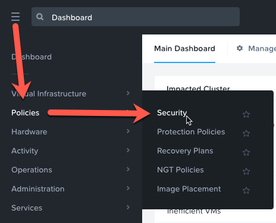

.. _securing_apps:

-----------------------------------------------------------
Securing applications with Flow (Network Microsegmentation)
-----------------------------------------------------------

Flow is an application-centric network security product tightly integrated into Nutanix AHV and Prism Central. Flow provides rich network traffic visualization, automation, and security for VMs running on AHV.
Microsegmentation is a component of Flow that uses simple policy-based management to secure VM networking. Using Prism Central categories (logical groups), you can create a powerful distributed firewall. Combining this with Calm allows automated deployment of applications that are secured as they are created.

In this exercise you will restrict access to the Fiesta application and protect traffic between the application tiers.

Securing the Fiesta Application

Flow provides multiple System categories out of the box, such as AppType, AppTier, and Environment, that are used to quickly group virtual machines. Security policies are applied using these categories. You can start using these pre-existing categories right away, or add your own categories for custom grouping.

Defining Category Values
++++++++++++++++++++++++

Prism Central uses categories as metadata to tag VMs to determine how policies will be applied.

#.	In **Prism Central**, select :fa:`bars` **> Virtual Infrastructure > Categories**.

        .. figure:: images/1-1.png

#.	Select the checkbox for **AppType** and click **Actions > Update**.

        .. figure:: images/1-2.png

#.	Click the :fa:`plus-circle` icon beside the last value to add an additional Category value.

        .. figure:: images/1-3.png

#.	Specify **Fiesta** as the value name.

        .. figure:: images/1-4.png

#.	Click **Save**.

#.	Select the checkbox for **AppTier** and click **Actions > Update**.

        .. figure:: images/1-5.png

#.	Click the :fa:`plus-circle` icon beside the last value to add an additional Category value.

        .. figure:: images/1-6.png

#.	Specify **FiestaWeb** as the value name. This category will be applied to the application’s web tier.

#.	Click :fa:`plus-circle` and specify **FiestaDB**. This category will be applied to the application's MySQL database tier.

        .. figure:: images/1-7.png

#.	Click **Save**.

Creating a Security Policy
..........................

*Nutanix Flow includes a policy-driven security framework that uses a workload-centric approach instead of a network-centric approach. Therefore, it can scrutinize traffic to and from VMs no matter how their network configurations change and where they reside in the data center. The workload-centric, network-agnostic approach also enables the virtualization team to implement these security policies without having to rely on network security teams.*

*Security policies are applied to categories and not to the VMs themselves. Therefore, it does not matter how many VMs are started up in a given category. Traffic associated with the VMs in a category is secured without administrative intervention, at any scale.*

Create the security policies that will protect the Fiesta application.

#.	In **Prism Central**, select :fa:`bars` **> Policies > Security Policies**.

#.	Click **Create Security Policy > Secure Applications (App Policy) > Create**.

#.	Fill out the following fields:

    - **Name** - Fiesta
    - **Purpose** - Restrict unnecessary access to Fiesta
    - **Secure this app** - AppType:Fiesta
    - Do **NOT** select **Filter the app type by category**
    - (Optional, if **Syslog** configured for cluster) Enable **Policy Hit Logs**

    .. figure:: images/2-2.png

#.	Click **Next**.

#.	If prompted, click **OK, Got it!** on the tutorial diagram of the **Create App Security Policy** wizard.

*By default, the policy builder will let you control what goes in and comes out of an application based on its AppType category, but we want to get more granular than that, to ensure only certain traffic is allowed based on the individual tiers - letting us allow client traffic to our web tier, but not allow any direct client traffic to the database.*

#.	Click **Set rules on App Tiers, instead**.

    .. figure:: images/2-3.png

#.	Click **Select a Tier to add**.

    .. figure:: images/2-3b.png

#.	Select **AppTier:FiestaWeb** from the drop down.

#.	Repeat Steps 7-8 for **AppTier:FiestaDB**.

    .. figure:: images/2-4.png

    *Next you will define the Inbound rules, which control which sources you will allow to communicate with your application. You can allow all inbound traffic, or define whitelisted sources. By default, the security policy is set to deny all incoming traffic.*

    *In this scenario we want to allow inbound TCP traffic to the web tier on TCP port 80 from all clients.*

#.	Under **Inbound**, click **+ Add Source**.
#.	Fill out the following fields to allow all inbound IP addresses:

   - **Add source by:** - Select **Subnet/IP**
   - Specify **0.0.0.0/0**

    .. figure:: images/2-5.png

#. Click **Add**.

  *Sources can also be specified by Categories, allowing for greater flexibility as this data can follow a VM regardless of changes to its network location. As an example, you could add a category for Administrator desktops that would also allow connections to the web and database via SSH (TCP Port 22).*

#.	To create an inbound rule, select your **0.0.0.0 Inbound Traffic Subnet** and click the :fa:`pencil` icon that appears to the left of **AppTier:FiestaWeb**.

#.	Under **Service Details**, click **Select a service**.

    Flow includes pre-defined entries for many common network services, and also allows for multiple services to be specified in a single rule. In this instance, you want to allow HTTP traffic to your webserver VMs.

#.	Under **Service Name** enter **http** to use the existing service to allow for TCP/UDP Port 80 traffic.

    .. figure:: images/2-6.png

    .. note::

      You can define your own custom services (e.g. for homegrown apps) by clicking **+ New service** and specifying protocol(s) and port(s) to include.

      Multiple services (protocols and ports) can be added to a single rule.

#.	Click **Save**.

#.	Under **Inbound**, click **+ Add Source**.

#. Fill out the following fields:

   - **Add source by:** - Select **Subnet/IP**
   - Specify *Your Prism Central IP*\ /32

    .. figure:: images/2-7.png

   .. note::

     The **/32** denotes a single IP as opposed to a subnet range.

#. Click **Add**.

#.	Select your **Prism Central Inbound Traffic Subnet** and click the :fa:`pencil` icon that appears to the left of **AppTier:FiestaWeb**.

    .. figure:: images/2-6a.png

#. Click **Select a Service** and enter **ssh** as the **Service Name** to allow TCP/UDP Port 22 traffic.

    .. figure:: images/2-8.png

#. Click **Save**.

#.	Repeat Steps 19-21 for **AppTier:FiestaDB**.

*By default, the security policy allows the application to send all outbound traffic to any destination. For this example we'll assume the only outbound communication required for your application is to communicate with your DNS server.*

#. Under **Outbound**, select **Allowed List Only** from the drop down menu, and click **+ Add Destination**.

    .. figure:: images/2-10.png

#. Fill out the following fields:

   - **Add Destination by:** - Select **Subnet/IP**
   - Specify *Your Domain Controller IP*\ /32

    .. figure:: images/2-11.png

#. Click **Add**.

#. Select the **+** icon that appears to the right of **AppTier:FiestaWeb**, click **Select a Service**, enter **domain** for the Service Name,  and click **Save** to allow DNS traffic.

    .. figure:: images/2-12.png

#.	Repeat this for **AppTier:FiestaDB**

    *Each tier of the application communicates with other tiers and the policy must allow this traffic. Some tiers such as web do not require communication within the same tier.*

#.	To define intra-app communication, click **Set Rules within App**.

    .. figure:: images/2-13.png

#.	Click **AppTier:FiestaWeb**, click **Edit** and select **No** to prevent communication between VMs in this tier.

    .. figure:: images/2-14.png

    *If this application scaled out to multiple webserver VMs, there wouldn't be a reason for them to communicate with one another, so this reduces attack surface.*

#.	While **AppTier:FiestaWeb** is still selected, click the :fa:`plus-circle` icon to the right of **AppTier:FiestaDB** to create a tier-to-tier rule.

    .. figure:: images/2-15.png

#.	Click **Select a Service**, enter **mysql** for the Service Name.

    .. figure:: images/2-16.png

#.	Click **Save**.

#. Click **Next** to review the security policy.

    .. figure:: images/2-17.png

#. Click **Save and Monitor**.

    .. figure:: images/2-18.png

Assigning Category Values
.........................

You will now apply the previously created categories to the VMs provisioned for the Fiesta application. Flow categories can be assigned as part of a Calm blueprint, but the purpose of this exercise is to understand category assignment to existing virtual machines.

#.	In **Prism Central**, select :fa:`bars` **> Virtual Infrastructure > VMs**.

    .. figure:: images/3-1.png

#.	Click **Filters** in the upper right, to expand the Filters view.

    .. figure:: images/3-2.png

#.  Check the box in the **Name** section, enter **Fiesta** under **Contains** and press return to display the Fiesta application virtual machines.

    .. figure:: images/3-3.png

#.	Using the checkboxes, select the 2 VMs associated with the application (**FiestaWeb and FiestaMYSQL**) and select **Actions > Manage Categories**.

    .. figure:: images/3-4.png

#.	Enter **Fiesta** in the search bar and select **AppType:Fiesta**

    .. figure:: images/3-5.png

#.  Click **Save** to assign the category to all VMs.

#.	Select ONLY the **FiestaWeb** VM, select **Actions > Manage Categories**. specify the **AppTier:FiestaWeb** category and click **Save**.

    .. figure:: images/3-6.png

#. Specify the **AppTier:FiestaWeb** category and click **Save**.

    .. figure:: images/3-7.png

#.	Repeat Step 7 and 8 to assign **AppTier:FiestaDB** to the FiestaMYSQL VM.

Now we will assign a category to the **WinToolsVM**

#.	In the search box in the upper left corner, enter **WinToolsVm**, and select the **WinToolsVM** VM from the list.

    .. figure:: images/3-8.png

#. Click **More**, then click **Manage Categories** on the drop-down.

    .. figure:: images/3-9.png

#. In the **Set Categories** section, enter **dev** in the last box, and click on **Environment:Dev**.

    .. figure:: images/3-10.png

#. Click on the blue + to assign this category to the VM.

In this lab, you assigned the Environment:Dev category to the WinToolsVM, the AppType:Fiesta to the FiestaWeb and FiestaMYSQL VMs. In addition to categorizing the Fiesta VMs with the AppType, you also categorized each VM by AppTier - web and DB.

Monitoring and Applying a Security Policy
.........................................

Before applying the Flow policy, you will ensure the Fiesta application is working as expected.

Testing the Application
.......................

#.	From **Prism Central > Virtual Infrastructure > VMs**, note the IP addresses of your **FiestaMYSQL** and **FiestaWeb** VMs.

#.	Launch the console for your **WinTools** VM.

#.	From the WinTools console open a browser and access http://web-VM-IP/ (where web-VM-IP is the IP address of your FiestaWeb vm)

#.	Verify that the application loads and that products can be added and deleted.

#.	Open **Command Prompt** and run ``ping -t FiestaMYSQL-VM-IP`` to verify connectivity between the client and database. Leave the ping running.

#.	Open a second Command Prompt and run ``ping -t FiestaWeb-VM-IP`` to verify connectivity between the client and web server. Leave the ping running.

Using Flow Visualization
........................

#.	Return to **Prism Central** and select :fa:`bars` **> Virtual Infrastructure > Policies > Security Policies > FiestaFiesta**.

#.	Verify that your **WinTools** VM appears as an inbound source.

    *The source and line appear in yellow to indicate that traffic has been detected from your client VM.*

Are there any other detected outbound traffic flows? Hover over these connections and determine what ports are in use.

#.	Click **Update** to edit the policy.

#.	Click **Next** and wait for the detected traffic flows to populate.

#.	Mouse over the VM  **Wintools** source that was discovered and click **Allow Traffic**.

#.	Check the boxes next to the discovered traffic you want to permit within the policy. In this case we will permit traffic from our **WinTools** VM to the web server and block traffic to the DB server.

#. Click **Save**.

The IP address of your **Wintools** VM is now added to the permitted inbound list, with a connection to the web server. Mouse over the flow line, and verify the ICMP traffic is allowed. Note that there is still a discovered connection to the DB server. This is because we did not permit this traffic, so it is still showing as an exception to our policy rule.

#.	Click **Next > Save and Monitor** to update the policy.

Enforcing Flow Policies
.......................

In order for the policy you have defined to block traffic, the policy must be enforced.

#.	Select **FiestaFiesta** and click **Actions > Enforce**.

#.	Type **ENFORCE** in the confirmation dialogue and click **OK** to begin blocking traffic.

#.	Return to the **WinToolsVM** Vm console.

What happens to the continuous ping traffic from the Windows client to the database server? Is this traffic blocked?

#.	Verify that the Windows Client VM can still access the Fiesta application using the web browser and the web server IP address.

Can you still add new products under Products and update product quantities under Inventory?

Takeaways
•	Microsegmentation offers additional protection against malicious threats that originate from within the data center and spread laterally, from one machine to another.
•	Security policies leverage the text based categories in Prism Central.
•	Flow can restrict traffic on certain ports and protocols for VMs running on AHV.
•	The policy is created in Monitor mode, meaning traffic is not blocked until the policy is enforced. This is helpful to learn the connections and ensure no traffic is blocked unintentionally.
